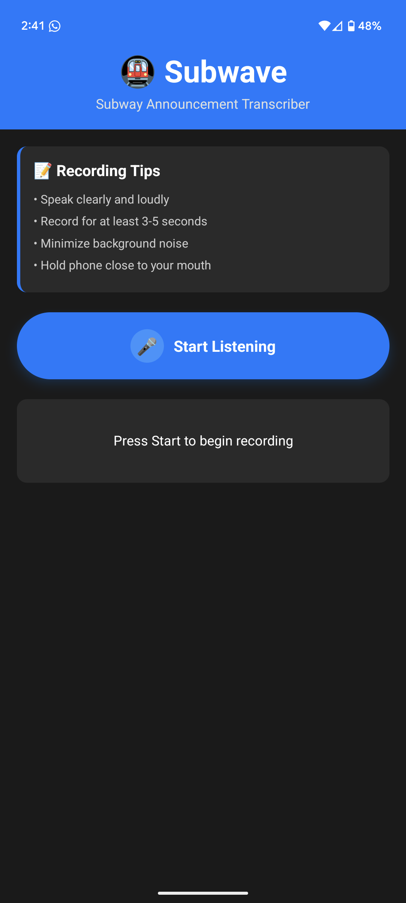

# Subwave

Subwave is a mobile app designed to transcribe subway announcements in noisy environments and deliver the transcribed announcements directly to your listening device. This helps users, especially those with hearing difficulties or in loud settings, never miss important subway information.

---

## Features

- **Real-time audio recording:** Capture subway announcements as they happen.
- **Speech-to-text transcription:** Convert announcements to readable text, even in noisy environments.
- **Direct delivery:** Send transcribed announcements to your listening device for easy access.
- **User-friendly interface:** Simple and intuitive design for quick use on the go.

---

## Technologies Used

- React Native (with Expo)
- TypeScript
- Custom audio recording hooks
- Speech-to-text services

---

## Getting Started

### Prerequisites

- [Node.js](https://nodejs.org/)
- [Expo CLI](https://docs.expo.dev/get-started/installation/)
- Google Cloud Speech-to-Text API key

### Installation

```bash
git clone https://github.com/yourusername/subwave.git
cd subwave
npm install
```

### Setting Up Google API Key

1. Go to the [Google Cloud Console](https://console.cloud.google.com/)
2. Create a new project or select an existing one
3. Enable the Speech-to-Text API
4. Create credentials (API Key)
5. Create a `.env` file in the project root and add your API key:
   ```
   GOOGLE_API_KEY=your-api-key-here
   ```

### Running the Project

```bash
npx expo start
```

### Usage

1. Open the app on your device (or use Expo Go).
2. Tap the record button to capture subway announcements.
3. View the transcribed text on your device.
4. (Optional) Connect your listening device for direct delivery.

---

## Screenshots

Main UI:



---

## Contributing

Contributions are welcome! Please open an issue or submit a pull request.

---

## License

MIT (or specify your preferred license) 
